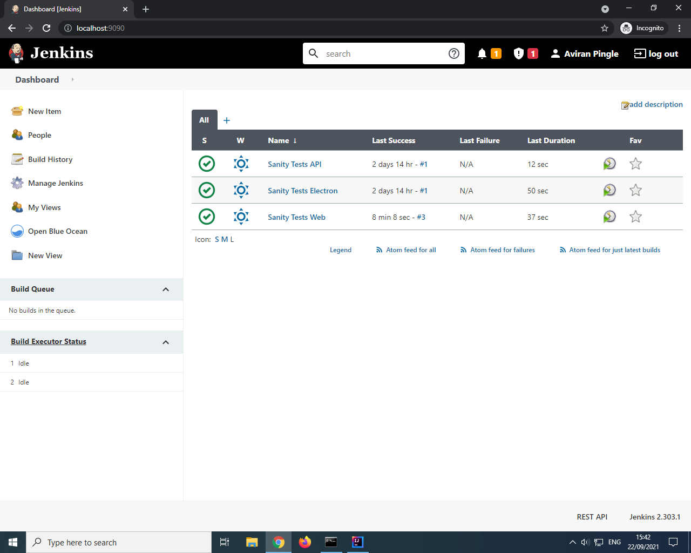
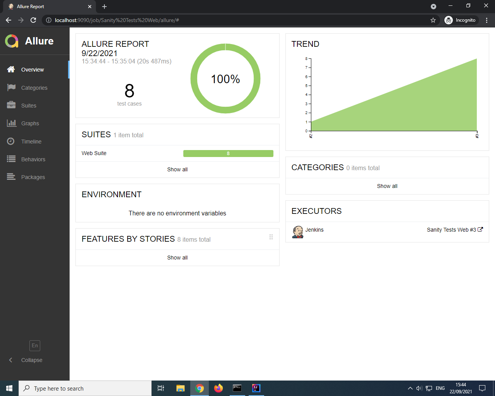

# fullstack-test-automation-final-project

## **Project Overview**

This project was created to demonstrate the skills I acquired during the fullstack automation course.
It contains a **modular automation testing infrastructure** that enables to test applications on various platforms.

 

---

### **_The infrastructure includes:_**

- Page Objects design pattern
- Different layers (extensions/ workflows/ test-cases etc.)
- Support for different clients/ browsers
- Failure mechanism
- External files support
- Reporting system (including screenshots)
- Visual testing
- DB support
- CI support

### **_Applications used in this project:_**

- Saucedemo - Webpage
- Mortgage calculator - Android application
- ReqRes API - a hosted REST API
- Todo List - Electron application
- Windows calculator - Desktop application

### **_Tools & Frameworks used in this project:_**

- TestNG - testing framework
- [Free MySQL Hosting](https://www.freemysqlhosting.net/)
- [Jenkins](https://www.jenkins.io/) - for tests execution
- REST Assured - for REST API testing
- [Allure Reports](http://allure.qatools.ru/) - as the main reporting system

### **_Known issues:_**

There are conflicts between io.appium and experitest dependencies, therefore we cannot run desktop and mobile tests together.

